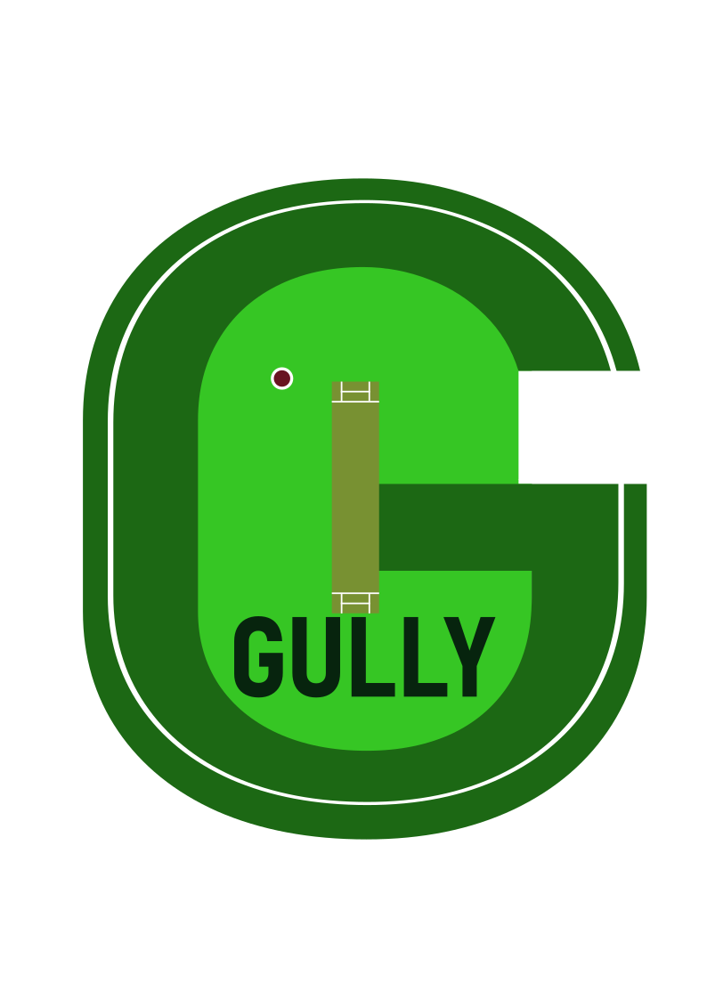

<div align="center">
  
  <!-- Logo placeholder - Replace with your actual logo -->
  
  
  # Gully
  
  ### *Because asking "How many wides did Pathirana bowl?" shouldn't require a CS degree*
  
[](https://fastapi.tiangolo.com/)
[](https://console.groq.com/)
[](https://gin-gonic.com/)
[](https://oauth.net/2/)
[](https://www.w3schools.com/sql/)
[](https://www.langchain.com/langgraph)
  
  **Talk cricket. We'll handle the Data.**
  
</div>

---

## What is Gully?

Gully is your AI-powered cricket statistician that speaks plain English. No more wrestling with SQL queries or spreadsheets to answer burning IPL questions. Just ask naturally, and get instant answers from our comprehensive ball-by-ball database (2008-2025).

**The Problem:** You want to know obscure IPL stats, but SQL is about as readable as Jadeja's bowling action.

**The Solution:** Gully translates your cricket curiosity into lightning-fast database queries.

### Example Queries
```
"How many sixes did Gayle hit in powerplays during IPL 2023?"
"Which bowler has the best economy rate at Wankhede?"
"What's Dhoni's strike rate in successful chases?"
```

---

## Our Ecosystem

<table>
  <tr>
    <td width="50%">
      <h3><a href="https://github.com/The-Gully/gully-core">gully-core</a></h3>
      <p><em>The brain of the operation</em></p>
      <ul>
        <li>AI agent for natural language → SQL conversion</li>
        <li>FastAPI backend with SQLAlchemy ORM</li>
        <li>CLI tool for quick queries</li>
        <li>Query optimization and caching</li>
      </ul>
    </td>
    <td width="50%">
      <h3><a href="https://github.com/The-Gully/go-gully-backend">go-gully-backend</a></h3>
      <p><em>The orchestrator</em></p>
      <ul>
        <li>High-performance Go-GIN REST API</li>
        <li>Google OAuth authentication</li>
        <li>PostgreSQL database management</li>
        <li>User session & rate limiting</li>
      </ul>
    </td>
  </tr>
</table>

### Under Active Development

<table>
  <tr>
    <td>
      <h4><a href="https://github.com/Astrasv/gully-graph">gully-graph</a></h4>
      <p><em>Graph + IPL = Something amazing is cooking...</em></p>
    </td>
  </tr>
</table>

---

## Key Features

### Natural Language Processing
Ask questions like you're chatting with your cricket buddy, not a database admin.

### Discord-Style Tagging
Use intuitive tags for consistency:
- `@players` — MS Dhoni, Virat Kohli, AB de Villiers
- `@teams` — Mumbai Indians, Chennai Super Kings
- `@venues` — Wankhede Stadium, Eden Gardens
- `@umpires` — Nitin Menon, Kumar Dharmasena
- `@cities` — Mumbai, Bangalore, Kolkata


## Tech Stack

<div align="center">
  
| Layer | Technologies |
|-------|-------------|
| **Frontend** | React 18, Vite, TailwindCSS |
| **Core Agent** | Python 3.8+, FastAPI, SQLAlchemy, Alembic |
| **Backend** | Go 1.19+, GIN Framework, PostgreSQL |
| **AI/ML** | LangChain, OpenAI/Anthropic APIs |
| **Database** | PostgreSQL 14+ with full-text search |
| **Auth** | Google OAuth 2.0 |
| **Deployment** | Docker, Kubernetes (coming soon) |

</div>
--- 

## Contributing

Looking for contributions SPECIFICALLY FOR FRONTEND
We welcome contributions from cricket enthusiasts and developers alike! Whether you're fixing a typo or adding support for T20 World Cup data, we'd love your help.

**Ways to Contribute:**
- Report bugs and issues
- Suggest new features or query types
- Improve documentation
- Write tests
- Design improvements
- Submit pull requests

---

## Fun Stats

*Using Gully's own data, of course:*

- **Total Deliveries Tracked:** 278205
- **Players in Database:** 778
- **Queries Processed:** Growing daily

---

## License

This project is licensed under the MIT License - see the [LICENSE](LICENSE) file for details.

---

## Acknowledgments

- **Cricket data providers** [CricSheet](https://cricsheet.org/) for making this possible 
- **Our contributors** who make Gully better every day
- **The IPL** for 17+ years of entertainment and memes
- **That one friend** who always asks impossible cricket trivia

---

<div align="center">
  
  ### Made with care and an unhealthy obsession with cricket statistics
  
  **Star this repo if you love cricket as much as we do!**
  
  [Back to Top](#gully)
  
</div>
